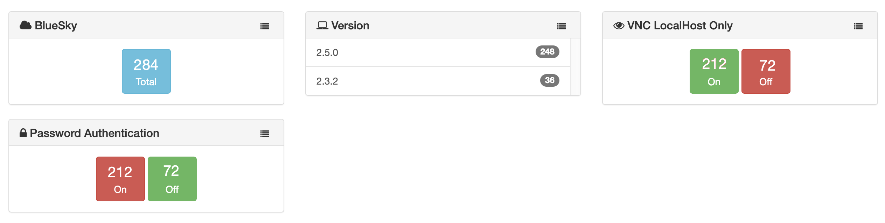

# BlueSky module

> v. 1.1.4 
> November 21, 2025 
> Alex Narvey / Precursor.ca  

Reports on BlueSky installs and shows some optional advanced security info.
(see: https://github.com/BlueSkyTools/BlueSkyConnect)

Retrieves information from the preferences file /var/bluesky/preference.plist.
And checks for VNC LocalHost Only and Password Authentication settings.
Setting up VNC Localhost Only would be more secure,
as would turning off Password Authentication in favour of SSH Keys.
The techniques for these methods were provided by Stefan Oberle in the BlueSky Connect Wiki.

The following information is stored in the table:

* version - The BlueSky version
* VNC Localhost only (you may enable this feature to increase security - see the Wiki)
* Password Authentication (you may turn this off when using SSH keys for added security - see the Wiki)

## Notes

An output file is only created if the preferences file exists in the /var/bluesky folder.
The output file is removed if the preferences file no longer exists so that new records will not be created.

## Updates

* November 21, 2025 Version 1.1.4 Improved formatting of client tab.
* August 1, 2025 Version 1.1.3 Improved the VNCLocalOnly Test
* August 1, 2025 Version 1.1.2 Correct API url in new widgets
* August 1, 2025 Version 1.1.1 Corrects a syntax error in the yml of a widget
* July 22, 2025 Version 1.1.0 Added widgets for VNC LocalHost ONLY and Password Authentication based on Advanced techniques suggested in the Wiki by Stefan Oberle
* June 3, 2025 Version 1.0.2 Updated composer json for packagist compatibility.
* July 6, 2021 Version 1.0.1 Correct test for -f file instead of -d directory. 
* April 5, 2021 Version 1.0 

## Contributors
* Alex Narvey

—
Alex Narvey
precursor.ca
